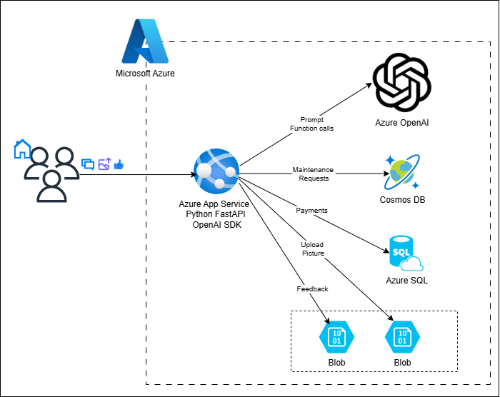

# Property Buddy

## Introduction
This project contains an AI Assistant who can seamlessly manage property matters for both apartment/units/townhouse tenants and property managers. It can answer you: 
- Payment inquiries.
- Request maintenance about property from preferred list of service providers, and ask its status, all without waiting for property manager. Super efficient!
- Tenants can chat with property buddy with language other than English. And your maintenance request will be created in English, so that service providers can understand it.

Additionally:
- You can provide feedback to the chat experience with property buddy.
- All your chats are not going to be used by others because we are using safe AI Models on Microsoft Cloud.  

### Example conversations (screenshots):
- When is my next payment due
- My shower is leaking
- When is my shower leakage is going to be fixed?
- Mon mur a un trou. ("My wall has got a hole in it" in French)

## Technical Architecture

- This is a Python app application, can be deployed to Azure App Service with one right click from VS Code. It deployed ChatGPT model on Azure OpenAI, with OpenAI API SDK. 
- This achieves RAG with real time data in Azure SQL and Cosmos DB, for customer's payments maintenance requests respectively.
- The chat solution is intelligent and adaptable. It requires much less software maintenance, more responsive, much faster to market, than traditional application. Because there is no hardcoded SQL Queries, rules of Categorization and Translation of Maintenance Request. These are all supplied by LLM during the chat 
- Continious improvement in future. Real user feedback will be utilised in future for contnious Evaluation of agent.  

### Resources and setup needed 
List of environment names 

### Programming stack
##Language: 
Python, Azure OpenAI, OpenAI API SDK

### Navigate this application 
- / :this is the chat interface
- /myrequests :Show all maintenance requests in COSMOS for specific customer
- /mypayments "Show all payments details in Azure SQL for specific customer
- /admin/feedback "Show all user feedback. Two tabs for list of positive and negative feedback respectively. (Please note no AuthN/AuthZ yet to be implemented in this solution)"