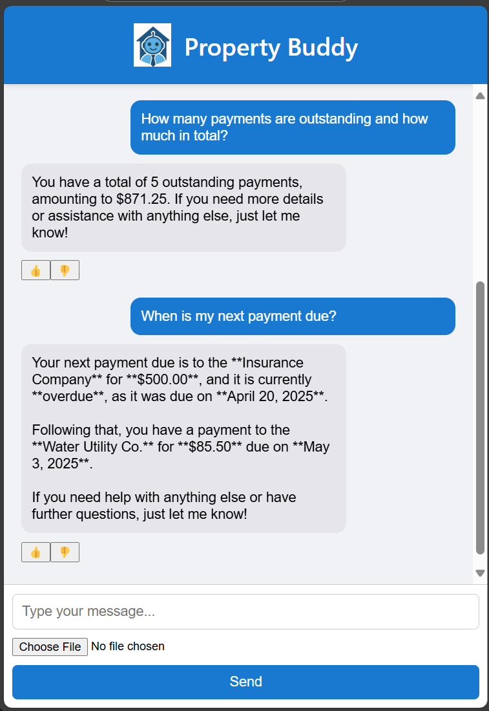
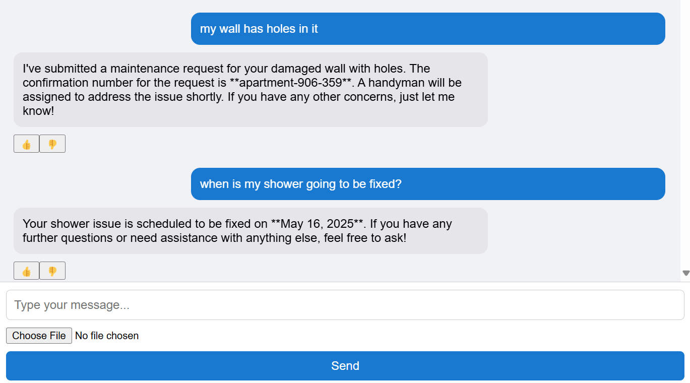
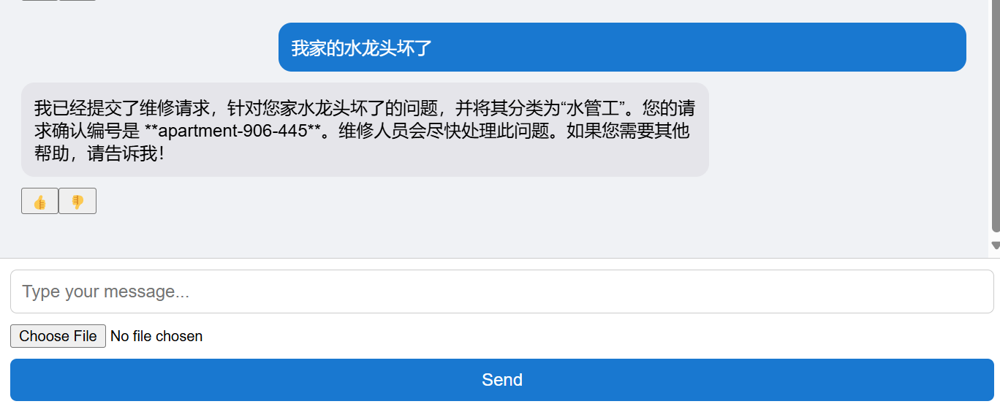
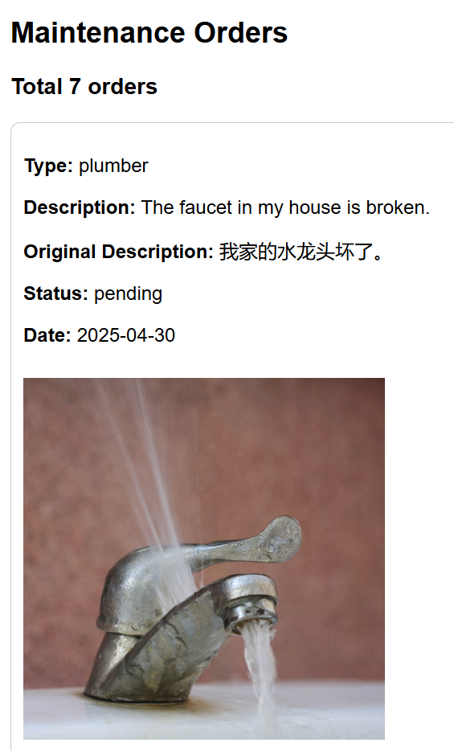
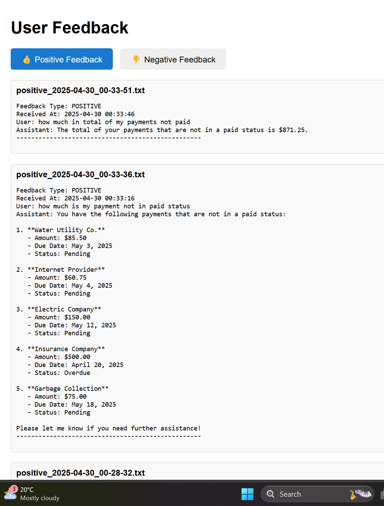

# Property Buddy

## Introduction
Say hello to this AI Assistant, who can seamlessly manage property matters for both apartment/units/townhouse tenants, landlords, and property managers. It can assist you to: 
- 💵 Ask for your payments details with natural chat.
- 🛠️ Request maintenance for your property from our preferred service providers, without waiting for property manager at all⏳! Such a seamless service chain! You can also check progress of your asks afterward!
- 🌐 Tenants can chat with property buddy with language other than English. And your maintenance request will be created in English, so that service providers can understand it.
- 📷 Of course you can upload picture when ask for property maintenance! 

- 👍 Additionally: Give us feedback about the chat experience with for our continious improvements.  
- 🔒 Your chat data is securely handled and remains private, adhering to Microsoft Cloud compliance standards.

## Technical Architecture

- This Python FastAPI app application can be easily deployed to Azure App Service. It deployed ChatGPT model on Azure OpenAI, with OpenAI SDK. 
- RAG with real time data in Azure SQL and Cosmos DB, for customer's payments maintenance requests respectively. 
- Neither SQL Queries coded in the chat solution, nor coded rules of maintenance classification or translation. These are all supplied by LLM during the chat. Hence, request can be sent to service provider directly after classified by LLM, without intervention from property managers. 
- Picture are uploaded into Azure Blob Storage, together with the maintenance request.
- User feedback is collected into Blob Storage, will be utilized for continuous Evaluation of agent in future.

🚀 Comparing with traditional applications, it requires much less software maintenance, is more adaptable and flexible, and much faster to market. This means lower license costs for property managers, resulting in reduced fees for tenants and landlords. 


### Resources and setup needed 
List of environment variables

```.env file
PROPERTY_ID="sample-customer-id"
OPENAI_API_TYPE=azure
OPENAI_API_KEY="sample-openai-api-key"
OPENAI_API_BASE="https://sample-openai-api-base.cognitiveservices.azure.com/"
OPENAI_API_VERSION="sample-openai-api-version"
AZURE_DEPLOYMENT_ID="sample-azure-ai-deployment-id"
AZURE_OPENAI_ENDPOINT="https://sample-openai-endpoint.cognitiveservices.azure.com/"
AZURE_OPENAI_API_VERSION="sample-openai-api-version"
AZURE_OPENAI_API_KEY="sample-openai-api-key"
AZURE_OPENAI_API_TYPE=azure
COSMOS_ENDPOINT="https://sample-cosmos-endpoint.documents.azure.com:443/"
BLOB_CONNECTION_STRING="DefaultEndpointsProtocol=https;AccountName=sample-account-name;AccountKey=sample-account-key;EndpointSuffix=core.windows.net"
AZURE_SQL_SERVER="sample-sql-server.database.windows.net"
AZURE_SQL_DATABASE="sample-sql-database"
AZURE_SQL_USERNAME="sample-sql-username"
AZURE_SQL_PASSWORD="sample-sql-password"
```

To grant management identity of Azure App Service access as Cosmos Data Contributor, please refer to [this guide](https://learn.microsoft.com/en-us/azure/cosmos-db/nosql/how-to-grant-data-plane-access). 

## User Experiences

### Navigating the application

| Route  | Description |
| ------------- |:-------------:|
| /      | Home page is the chat interface    |
| /myrequests     | Show all maintenance requests sent to service providers in Cosmos DB, for specific customer|
| /mypayments     | Show all payments details in Azure SQL for specific customer   |
| /admin/feedback     | Show all user feedback. Two tabs for list of positive and negative feedback respectively. (Please note no AuthN/AuthZ yet to be implemented in this solution) | 

Note. The specific customer id is set in environment variables (PROPERTY ID) for this proof of concept. Only data for specified customer are used during the chat.

## Example conversations
- When is my next payment due?
- My shower is leaking.
- When is my shower leakage is going to be fixed?
- Mon mur a un trou. ("My wall has got a hole in it" in French)







## Non-english order sent to service provider with English



### Collected feedback



